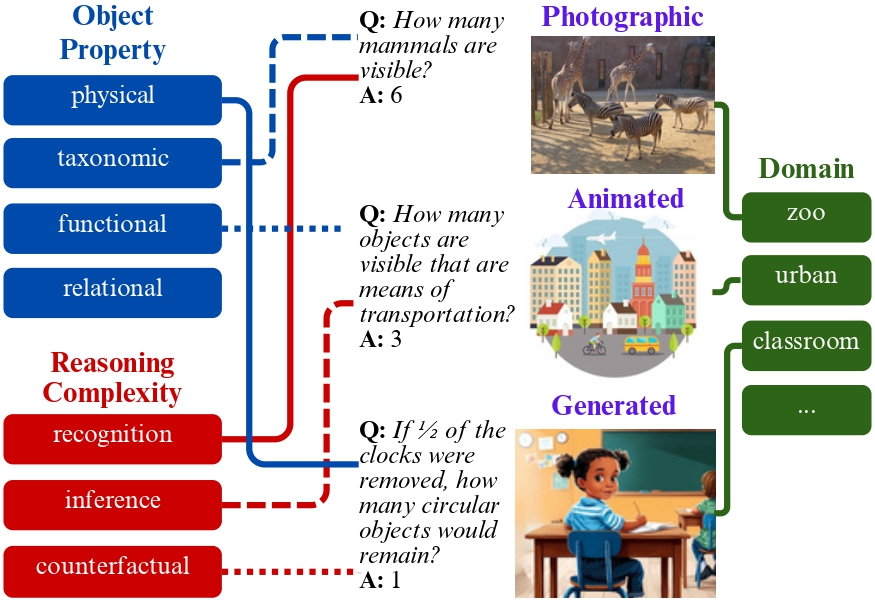
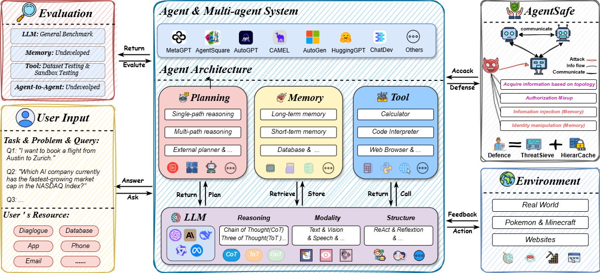
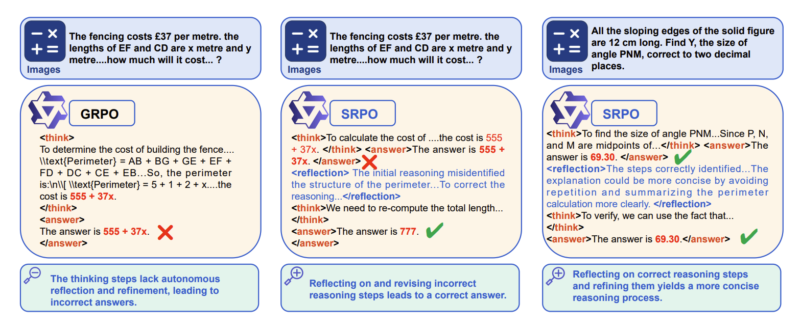
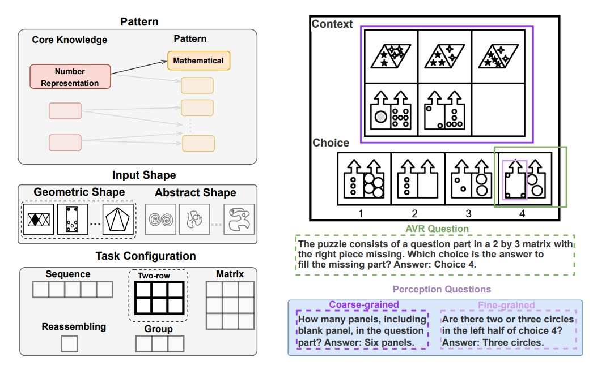
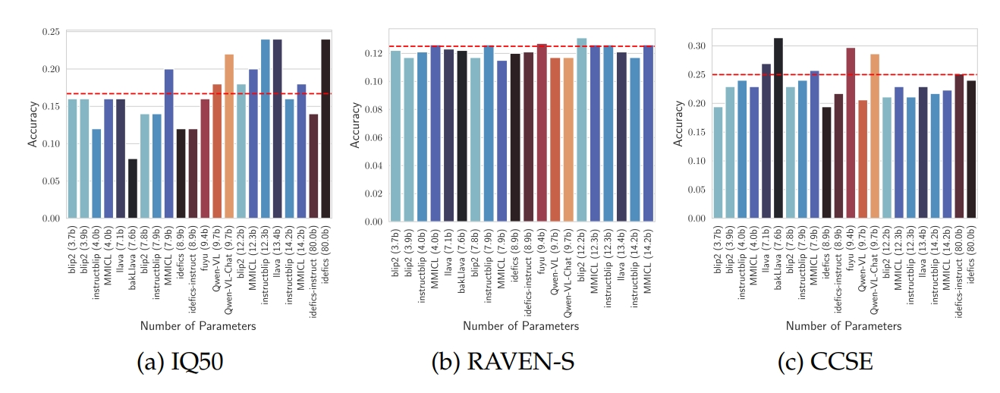
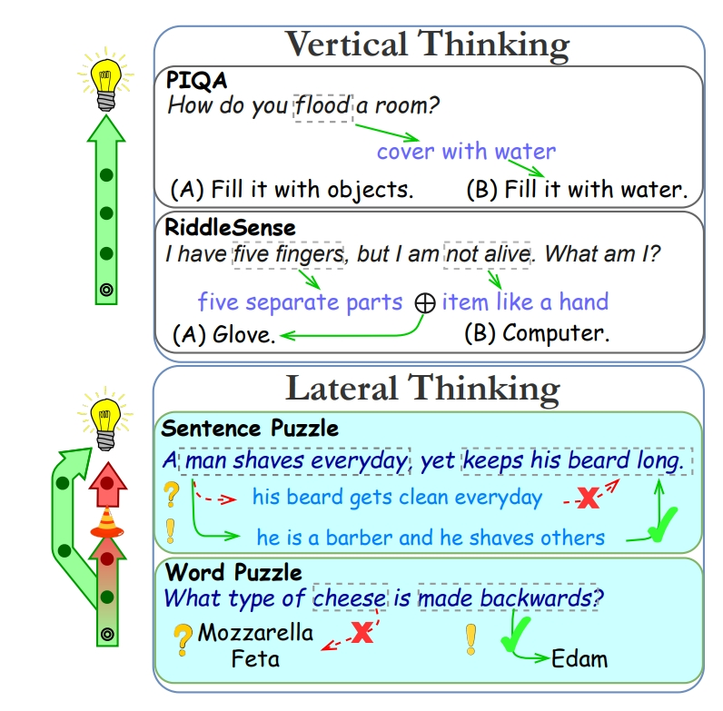
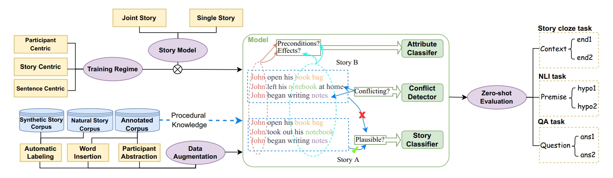
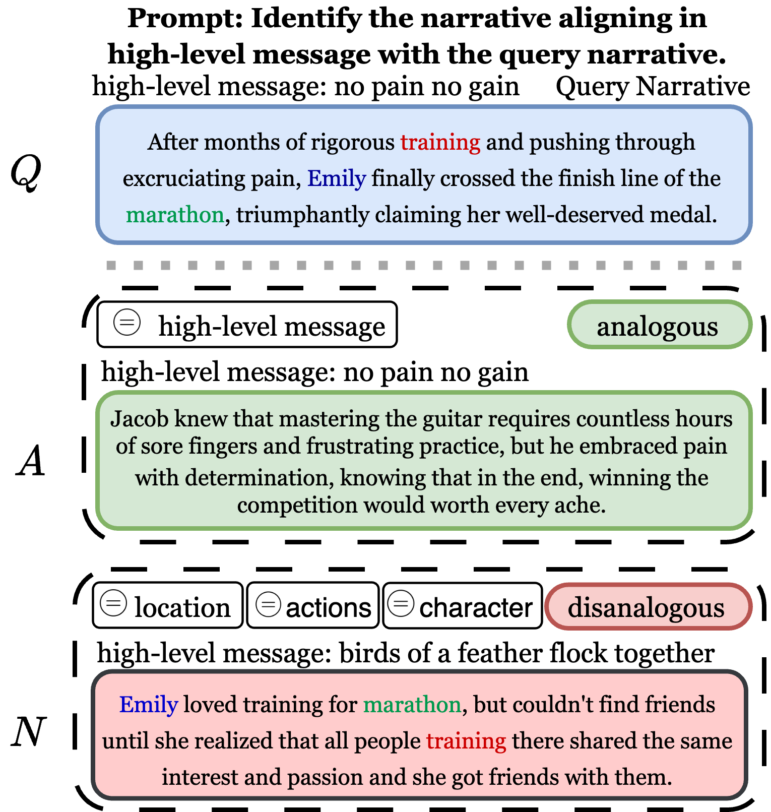
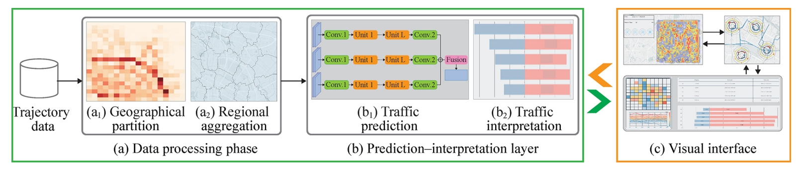

## Preprint

- ### ORBIT: An Object Property Reasoning Benchmark for Visual Inference Tasks
Abhishek Kolari, Mohammadhossein Khojasteh, ***Yifan Jiang***, Floris den Hengst, Filip Ilievski
  
  

    
Abstract

    

      While vision-language models (VLMs) have made remarkable progress on many popular visual question answering (VQA) benchmarks, it remains unclear whether they abstract and reason over depicted objects. Inspired by human object categorisation, object property reasoning involves identifying and recognising low-level details and higher-level abstractions. While current VQA benchmarks consider a limited set of object property attributes like size, they typically blend perception and reasoning, and lack representativeness in terms of reasoning and image categories. To this end, we introduce a systematic evaluation framework with images of three representative types, three reasoning levels of increasing complexity, and four object property dimensions driven by prior work on commonsense reasoning. We develop a procedure to instantiate this benchmark into ORBIT, a multilevel reasoning VQA benchmark for object properties comprising 360 images paired with a total of 1,080 count-based questions. Experiments with 12 state-of-the-art VLMs in zero-shot settings reveal significant limitations compared to humans, with the best-performing model only reaching 40% accuracy. VLMs struggle particularly with realistic (photographic) images, counterfactual reasoning about physical and functional properties, and higher counts. ORBIT points to the need to develop methods for scalable benchmarking, generalize annotation guidelines, and explore additional reasoning VLMs. We make the ORBIT benchmark and the experimental code available to support such endeavors.
    

  
  
  [Paper](https://arxiv.org/pdf/2508.10956)|[Github](https://github.com/AbhishekKolari/ORBIT) 

- ### A Comprehensive Survey in LLM(-Agent) Full Stack Safety: Data, Training and Deployment
  
  

    
Abstract

    

      The remarkable success of Large Language Models (LLMs) has illuminated a promising pathway toward achieving Artificial General Intelligence for both academic and industrial communities, owing to their unprecedented performance across various applications. As LLMs continue to gain prominence in both research and commercial domains, their security and safety implications have become a growing concern, not only for researchers and corporations but also for every nation. Currently, existing surveys on LLM safety primarily focus on specific stages of the LLM lifecycle, e.g., deployment phase or fine-tuning phase, lacking a comprehensive understanding of the entire "lifechain" of LLMs. To address this gap, this paper introduces, for the first time, the concept of "full-stack" safety to systematically consider safety issues throughout the entire process of LLM training, deployment, and eventual commercialization. Compared to the off-the-shelf LLM safety surveys, our work demonstrates several distinctive advantages: (I) Comprehensive Perspective. We define the complete LLM lifecycle as encompassing data preparation, pre-training, post-training, deployment and final commercialization. To our knowledge, this represents the first safety survey to encompass the entire lifecycle of LLMs. (II) Extensive Literature Support. Our research is grounded in an exhaustive review of over 800+ papers, ensuring comprehensive coverage and systematic organization of security issues within a more holistic understanding. (III) Unique Insights. Through systematic literature analysis, we have developed reliable roadmaps and perspectives for each chapter. Our work identifies promising research directions, including safety in data generation, alignment techniques, model editing, and LLM-based agent systems. These insights provide valuable guidance for researchers pursuing future work in this field.
    

  
  
  [Paper](https://arxiv.org/abs/2504.15585) 

---

## 2025

- ### SRPO: Enhancing Multimodal LLM Reasoning via Reflection-Aware Reinforcement Learning
Zhongwei Wan, Zhihao Dou, Che Liu, Yu Zhang, Dongfei Cui,
Qinjian Zhao, Hui Shen, Jing Xiong, Yi Xin, ***Yifan Jiang***, 
Chaofan Tao, Yangfan He, Mi Zhang, Shen Yan 
*NeurIPS* 
  
  

    
Abstract

    

   Multimodal large language models (MLLMs) have shown promising capabilities in reasoning tasks, yet still struggle significantly with complex problems requiring explicit self-reflection and self-correction, especially compared to their unimodal text-based counterparts. Existing reflection methods are simplistic and struggle to generate meaningful, instructive feedback, as the reasoning ability and knowledge limits of pre-trained models are largely fixed during initial training. To overcome these challenges, we propose multimodal Self-Reflection enhanced reasoning with Group Relative Policy Optimization SRPO, a two-stage reflection-aware reinforcement learning (RL) framework explicitly designed to enhance multimodal LLM reasoning. In the first stage, we construct a high-quality, reflection-focused dataset under the guidance of an advanced MLLM, which generates reflections based on initial responses to help the policy model to learn both reasoning and self-reflection. In the second stage, we introduce a novel reward mechanism within the GRPO framework that encourages concise and cognitively meaningful reflection while avoiding redundancy. Extensive experiments across multiple multimodal reasoning benchmarks—including MathVista, MathVision, Mathverse, and MMMU-Pro—using Qwen-2.5-VL-7B and Qwen-2.5-VL-32B demonstrate that SRPO significantly outperforms state-of-the-art models, achieving notable improvements in both reasoning accuracy and reflection quality.
    

  
  
  [Paper](https://arxiv.org/pdf/2506.01713)

- ### Recent Advances in Large Langauge Model Benchmarks against Data Contamination: From Static to Dynamic Evaluation
*EMNLP* 
   Simin Chen, Yiming Chen, Zexin Li, ***Yifan Jiang***, Zhongwei Wan, Yixin He, Dezhi Ran, Tianle Gu, Haizhou Li, Tao Xie, Baishakhi Ray
  
  

    
Abstract

    

      Data contamination has received increasing attention in the era of large language models (LLMs) due to their reliance on vast Internet-derived training corpora. To mitigate the risk of potential data contamination, LLM benchmarking has undergone a transformation from static to dynamic benchmarking. In this work, we conduct an in-depth analysis of existing static to dynamic benchmarking methods aimed at reducing data contamination risks. We first examine methods that enhance static benchmarks and identify their inherent limitations. We then highlight a critical gap-the lack of standardized criteria for evaluating dynamic benchmarks. Based on this observation, we propose a series of optimal design principles for dynamic benchmarking and analyze the limitations of existing dynamic benchmarks. This survey provides a concise yet comprehensive overview of recent advancements in data contamination research, offering valuable insights and a clear guide for future research efforts. We maintain a GitHub repository to continuously collect both static and dynamic benchmarking methods for LLMs. The repository can be found at this link.
    

  
  
  [Paper](https://arxiv.org/abs/2502.17521) | [Github](https://github.com/SeekingDream/Static-to-Dynamic-LLMEval) 

- ### RED QUEEN: Safeguarding Large Language Models against Concealed Multi-Turn Jailbreaking
*ACL Findings* 
   ***Yifan Jiang***, Kriti Aggarwal, Tanmay Laud, Kashif Munir, Jay Pujara, Subhabrata Mukherjee 
  
  

    
Abstract

    

      The rapid progress of Large Language Models (LLMs) has opened up new opportunities across various domains and applications; yet it also presents challenges
      related to potential misuse. To mitigate such risks, red teaming has been employed
      as a proactive security measure to probe language models for harmful outputs via
      jailbreak attacks. However, current jailbreak attack approaches are single-turn with
      explicit malicious queries that do not fully capture the complexity of real-world
      interactions. In reality, users can engage in multi-turn interactions with LLM-based
      chat assistants, allowing them to conceal their true intentions in a more covert
      manner. To bridge this gap, we, first, propose a new jailbreak approach, RED
      QUEEN ATTACK. This method constructs a multi-turn scenario, concealing the
      malicious intent under the guise of preventing harm. We craft 40 scenarios that
      vary in turns and select 14 harmful categories to generate 56k multi-turn attack
      data points. We conduct comprehensive experiments on the RED QUEEN ATTACK
      with four representative LLM families of different sizes. Our experiments reveal
      that all LLMs are vulnerable to RED QUEEN ATTACK, reaching 87.62% attack
      success rate on GPT-4o and 75.4% on Llama3-70B. Further analysis reveals that
      larger models are more susceptible to the RED QUEEN ATTACK, with multi-turn
      structures and concealment strategies contributing to its success. To prioritize
      safety, we introduce a straightforward mitigation strategy called RED QUEEN
      GUARD, which aligns LLMs to effectively counter adversarial attacks. This approach reduces the attack success rate to below 1% while maintaining the model’s
      performance across standard benchmarks.
    

  
  
  [Paper](https://arxiv.org/pdf/2409.17458) | [Github](https://github.com/kriti-hippo/red_queen) | [Project Website](https://redqueen1011.github.io/)

- ### COLUMBUS: Evaluating COgnitive Lateral Understanding through Multiple-choice reBUSes
  *AAAI* 
    Koen Kraaijveld, ***Yifan Jiang***, Kaixin Ma, Filip Ilievski  
  
  

    
Abstract

    

      While visual question-answering (VQA) benchmarks have catalyzed the development of reasoning techniques, they have focused on vertical thinking. Effective  
      problem-solving also necessitates lateral thinking, which remains understudied in AI and has not been used to test visual perception systems. To bridge this
      gap, we formulate visual lateral thinking as a multiple-choice question-answering task and describe a three-step taxonomy-driven methodology for instantiating
      task examples. Then, we develop COLUMBUS, a synthetic benchmark that applies the task pipeline to create QA sets with text and icon rebus puzzles based on
      publicly available collections of compounds and common phrases. COLUMBUS comprises over 1,000 puzzles, each with four answer candidates. While the SotA vision
      language models (VLMs) achieve decent performance, our evaluation demonstrates a substantial gap between humans and models. VLMs benefit from human-curated
      descriptions but struggle to self-generate such representations at the right level of abstraction.
    

  
  
  [Paper](https://arxiv.org/abs/2409.04053) | [GitHub](https://github.com/koen-47/COLUMBUS) | [Notebook](https://github.com/koen-47/COLUMBUS/tree/main/notebooks)| [Project Website](https://columbus-vqa.github.io/) | [Media Coverage](https://www.bbc.com/future/article/20240912-what-riddles-teach-us-about-the-human-mind)

---

## 2024

- ### MARVEL: Multidimensional Abstraction and Reasoning through Visual Evaluation and Learning
  *NeurIPS DB track* 
   ***Yifan Jiang***\*, Jiarui Zhang\*, Kexuan Sun\*, Zhivar Sourati,  
   Kian Ahrabian, Kaixin Ma, Filip Ilievski, Jay Pujara  
  
  

    
Abstract

    

     While multi-modal large language models (MLLMs) have shown significant progress on many popular visual reasoning benchmarks, whether
    they possess abstract visual reasoning abilities remains an open question.
    Similar to the Sudoku puzzles, abstract visual reasoning (AVR) problems
    require finding high-level patterns (e.g., repetition constraints) that control
    the input shapes (e.g., digits) in a specific task configuration (e.g., matrix). However, existing AVR benchmarks only considered a limited set
    of patterns (addition, conjunction), input shapes (rectangle, square), and
    task configurations (3 × 3 matrices). To evaluate MLLMs’ reasoning abilities comprehensively, we introduce MARVEL, a multidimensional AVR
    benchmark with 770 puzzles composed of six core knowledge patterns,
    geometric and abstract shapes, and five different task configurations. To inspect whether the model accuracy is grounded in perception and reasoning,
    MARVEL complements the general AVR question with perception questions in a hierarchical evaluation framework. We conduct comprehensive
    experiments on MARVEL with nine representative MLLMs in zero-shot
    and few-shot settings. Our experiments reveal that all models show near-random performance on the AVR question, with significant performance
    gaps (40%) compared to humans across all patterns and task configurations. Further analysis of perception questions reveals that MLLMs struggle
    to comprehend the visual features (near-random performance) and even
    count the panels in the puzzle (<45%), hindering their ability for abstract
    reasoning.
    

  
  
  [Paper](https://arxiv.org/pdf/2404.13591) | [GitHub](https://github.com/1171-jpg/MARVEL_AVR) | [Project Website](https://marvel770.github.io/)  | [Hugging Face](https://huggingface.co/datasets/kianasun/MARVEL)  

- ### The curious case of nonverbal abstract reasoning with multi-modal large language models
  *COLM* 
  Kian Ahrabian*, Zhivar Sourati*, Kexuan Sun*, Jiarui Zhang,  
  ***Yifan Jiang***, Fred Morstatter, Jay Pujara 
    
  

    
Abstract

    

      While large language models (LLMs) are still being adopted to new domains and utilized in novel applications, we are experiencing an influx of the new generation of foundation models, namely multi-modal large language models (MLLMs). These models integrate verbal and visual information, opening new possibilities to demonstrate more complex reasoning abilities at the intersection of the two modalities. However, despite the revolutionizing prospect of MLLMs, our understanding of their reasoning abilities is limited. In this study, we assess the nonverbal abstract reasoning abilities of open-source and closed-source MLLMs using variations of Raven's Progressive Matrices. Our experiments expose the difficulty of solving such problems while showcasing the immense gap between open-source and closed-source models. We also reveal critical shortcomings with individual visual and textual modules, subjecting the models to low-performance ceilings. Finally, to improve MLLMs' performance, we experiment with various methods, such as Chain-of-Thought prompting, resulting in a significant (up to 100%) boost in performance.
    

  
  
  [Paper](https://arxiv.org/pdf/2401.12117) 

- ### Fire: Food image to recipe generation
  *WACV* 
   Prateek Chhikara, Dhiraj Chaurasia, ***Yifan Jiang***, Omkar Masur, Filip Ilievski;
  
  

    
Abstract

    

  Food computing has emerged as a prominent multidisciplinary field of research in recent years. An ambitious goal of food computing is to develop end-to-end intelligent systems capable of autonomously producing recipe information for a food image. Current image-to-recipe methods are retrieval-based and their success depends heavily on the dataset size and diversity, as well as the quality of learned embeddings. Meanwhile, the emergence of powerful attention-based vision and language models presents a promising avenue for accurate and generalizable recipe generation, which has yet to be extensively explored. This paper proposes FIRE, a novel multimodal methodology tailored to recipe generation in the food computing domain, which generates the food title, ingredients, and cooking instructions based on input food images. FIRE leverages the BLIP model to generate titles, utilizes a Vision Transformer with a decoder for ingredient extraction, and employs the T5 model to generate recipes incorporating titles and ingredients as inputs. We showcase two practical applications that can benefit from integrating FIRE with large language model prompting: recipe customization to fit recipes to user preferences and recipe-to-code transformation to enable automated cooking processes. Our experimental findings validate the efficacy of our proposed approach, underscoring its potential for future advancements and widespread adoption in food computing.
    

  
  
  [Paper](https://openaccess.thecvf.com/content/WACV2024/html/Chhikara_FIRE_Food_Image_to_REcipe_Generation_WACV_2024_paper.html) 

- ### Semeval-2024 task 9: Brainteaser: A novel task defying common sense
  *Semeval@NAACL* 
  ***Yifan Jiang***, Filip Ilievski, Kaixin Ma
  

    
Abstract

    

      While vertical thinking relies on logical and commonsense reasoning, lateral thinking requires systems to defy commonsense associations and overwrite them through unconventional thinking. Lateral thinking has been shown to be challenging for current models but has received little attention. A recent benchmark, BRAINTEASER, aims to evaluate current models' lateral thinking ability in a zero-shot setting. In this paper, we split the original benchmark to also support fine-tuning setting and present SemEval Task 9: BRAIN-TEASER(S), the first task at this competition designed to test the system's reasoning and lateral thinking ability. As a popular task, BRAINTEASER(S)'s two subtasks receive 483 team submissions from 182 participants during the competition. This paper provides a fine-grained system analysis of the competition results, together with a reflection on what this means for the ability of the systems to reason laterally. We hope that the BRAINTEASER(S) subtasks and findings in this paper can stimulate future work on lateral thinking and robust reasoning by computational models.
    

  
  
  [Paper](https://aclanthology.org/2024.semeval-1.274/) | [GitHub](https://github.com/1171-jpg/BrainTeaser) | [Colab Website](https://codalab.lisn.upsaclay.fr/competitions/15566)| [Project Website](https://brainteasersem.github.io/) 

---

## 2023

- ### BRAINTEASER: Lateral Thinking Puzzles for Large Language Model
  *EMNLP* 
  ***Yifan Jiang***, Filip Ilievski, Kaixin Ma, Sourati Zhivar
  
  

    
Abstract

    

  The success of language models has inspired the NLP community to attend to tasks that require implicit and complex reasoning, relying on human-like commonsense mechanisms. While such vertical thinking tasks have been relatively popular, lateral thinking puzzles have received little attention. To bridge this gap, we devise BRAINTEASER: a multiple-choice Question Answering task designed to test the model's ability to exhibit lateral thinking and defy default commonsense associations. We design a three-step procedure for creating the first lateral thinking benchmark, consisting of data collection, distractor generation, and generation of adversarial examples, leading to 1,100 puzzles with high-quality annotations. To assess the consistency of lateral reasoning by models, we enrich BRAINTEASER based on a semantic and contextual reconstruction of its questions. Our experiments with state-of-the-art instruction- and commonsense language models reveal a significant gap between human and model performance, which is further widened when consistency across adversarial formats is considered. We make all of our code and data available to stimulate work on developing and evaluating lateral thinking models.
    

  
  
  [Paper](https://aclanthology.org/2023.emnlp-main.885/) | [GitHub](https://github.com/1171-jpg/BrainTeaser) 
  
- ### Transferring Procedural Knowledge across Commonsense Tasks
  *ECAI* 
  ***Yifan Jiang***, Filip Ilievski, Kaixin Ma
  
  

    
Abstract

    

    Stories about everyday situations are an essential part of human communication, motivating the need to develop AI agents that can reliably understand these stories. Despite the long list of supervised methods for story completion and procedural understanding, current AI fails to generalize its procedural reasoning to unseen stories. This paper is based on the hypothesis that the generalization can be improved by associating downstream prediction with fine-grained modeling and the abstraction of procedural knowledge in stories. To test this hypothesis, we design LEAP: a comprehensive framework that reasons over stories by jointly considering their (1) overall plausibility, (2) conflict sentence pairs, and (3) participant physical states. LEAP integrates state-of-the-art modeling architectures, training regimes, and augmentation strategies based on natural and synthetic stories. To address the lack of densely annotated training data on participants and their physical states, we devise a robust automatic labeler based on semantic parsing and few-shot prompting with large language models. Our experiments with in- and out-of-domain tasks reveal insights into the interplay of architectures, training regimes, and augmentation strategies. LEAP’s labeler consistently improves performance on out-of-domain datasets, while our case studies show that the dense annotation supports explainability.
    

  
  
  [Paper](https://ebooks.iospress.nl/doi/10.3233/FAIA230391) | [GitHub](https://github.com/1171-jpg/LEAP) 

## Journal Articles

- ### ARN: Analogical Reasoning on Narratives 
  *TACL* 
  Zhivar Sourati, Filip Ilievski, Pia Sommerauer, ***Yifan Jiang***
  
  

    
Abstract

    

      As a core cognitive skill that enables the transferability of information across domains, analogical reasoning has been extensively studied for both humans and computational models. However, while cognitive theories of analogy often focus on narratives and study the distinction between surface, relational, and system similarities, existing work in natural language processing has a narrower focus as far as relational analogies between word pairs. This gap brings a natural question: can state-of-the-art large language models (LLMs) detect system analogies between narratives? To gain insight into this question and extend word-based relational analogies to relational system analogies, we devise a comprehensive computational framework that operationalizes dominant theories of analogy, using narrative elements to create surface and system mappings. Leveraging the interplay between these mappings, we create a binary task and benchmark for Analogical Reasoning on Narratives (ARN), covering four categories of far (cross-domain)/near (within-domain) analogies and disanalogies. We show that while all LLMs can largely recognize near analogies, even the largest ones struggle with far analogies in a zero-shot setting, with GPT4.0 scoring below random. Guiding the models through solved examples and Chain-of-Thought reasoning enhances their analogical reasoning ability. Yet, since even in the few-shot setting, the best model only performs halfway between random and humans, ARN opens exciting directions for computational analogical reasoners.
    

  
  
  [Paper](https://watermark.silverchair.com/tacl_a_00688.pdf?token=AQECAHi208BE49Ooan9kkhW_Ercy7Dm3ZL_9Cf3qfKAc485ysgAAA0kwggNFBgkqhkiG9w0BBwagggM2MIIDMgIBADCCAysGCSqGSIb3DQEHATAeBglghkgBZQMEAS4wEQQMmsJwVnMxmrOhl3kRAgEQgIIC_BhUDBVHzgjmnETwcxlOCsdfKu-bO54lCB9GqGpeXXpWmUnryHCb0czjbAD3dc4bNc93xNaZYFzh1FHrWFAHKdvVUw1-Xx7DczHUlaAYTUDyPu5qPzEqqpKu3HK1W2eO4qqoKaR2VqLdm4xnPFg0x5JP-IZmLj5pS_X4n4n_Nbj8R_6SvF8_aDewRcXqXyAf_GlNcVb704T5Z23YHNtjNwapLl18YHGU2qX0PV-BJuCfOMqo0W2kG3Bfophe0V2OaSrUCvc--IxbPtx5E2cPeJJRpj9yh8G8D52Mdrzaa4sUdJiS-89HYEOAuFXB8xj3yY1ogOHrqDWNujI4vdfy9R6Z4gcOSLKrAazQiX1vLVJDR_FBSNmcRmmS8SYDPBf8q_BdrWN26_7tuxl-FpOIf4huH8KLaWd4jmbCb6eXlYxWxbSt9nUBIu_rQVZA5diDBCNlG2_bELMDoIevLqf98OIvIIy_Vvekh5sKfarut_hw6u_nXXVjfuutFiyleoKL4cKeHBIX6A1PDK6Jl14Z4K2o2ZgWnJ7gyprvS3a0XdF2-ncTzZWR72Nd_6hs2SvRGhkCdu_r7tPPJsAdfgMvFj5UtS14M9c-jL-nGR6sbvF6TJ_1IPbictM0fjNC7aZIPTPPgg2yjB3nO_0tjvGvIyy0ZSvyUi2omLL332qFcoYFaOOhjgIdZUjaA2y5cMuEki-tztsQLAJWTL49nT3Q6ApFNZaJNfp8mEXtFP-53R_nxjFc2qgUWlsu9K1xVoC95F80iXCVtspLfk6f1onn-LiuwiL0Z9jehR1_MdJkFVccR_3ObIIksNBZjRFULplDog9YKAiJkvKGoX8JJeHp0OAMJgTsA8cn6kCrLkzrydzY3gWcg-iIdysxTtcfKSNVe77k-6itiv-OTZ1GZiARXmsHBYLWMzrMt3Be-T5h_5wj0yB87WBKCmdhKyC3Od8LCAzITqpLesAI1WRp6BjUrPn3R__46wg2lXWzX1a4RBpq6xwCRSNVolejV51c) | [Data](https://zenodo.org/records/11044026) 

- ### TrafPS: A shapley-based visual analytics approach to interpret traffic
  *CVMJ* 
  Zezheng Feng, ***Yifan Jiang***, Hongjun Wang, Zipei Fan, 
  Yuxin Ma, Shuang-Hua Yang, Huamin Qu, Xuan Song 
  
  

    
Abstract

    

    Recent achievements in deep learning (DL) have demonstrated its potential in predicting traffic flows. Such predictions are beneficial for understanding the situation and making traffic control decisions. However, most state-of-the-art DL models are considered “black boxes” with little to no transparency of the underlying mechanisms for end users. Some previous studies attempted to “open the black box” and increase the interpretability of generated predictions. However, handling complex models on large-scale spatiotemporal data and discovering salient spatial and temporal patterns that significantly influence traffic flow remain challenging. To overcome these challenges, we present TrafPS, a visual analytics approach for interpreting traffic prediction outcomes to support decision-making in traffic management and urban planning. The measurements region SHAP and trajectory SHAP are proposed to quantify the impact of flow patterns on urban traffic at different levels. Based on the task requirements from domain experts, we employed an interactive visual interface for the multi-aspect exploration and analysis of significant flow patterns. Two real-world case studies demonstrate the effectiveness of TrafPS in identifying key routes and providing decision-making support for urban planning.
    

  
  
  [Paper](https://link.springer.com/article/10.1007/s41095-023-0351-7) 

